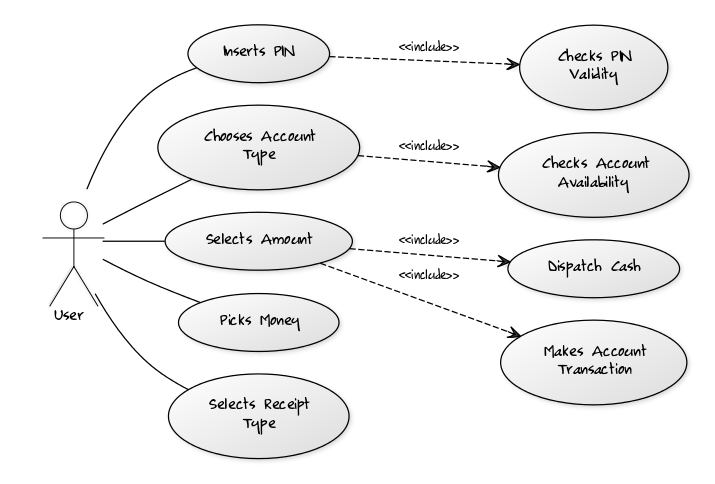
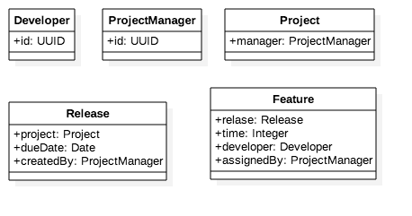
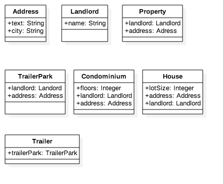

# WITHDRAW_MONEY Use Case Description: Main Flow

## 1. Use Case Description

|**User Action**                        |**System Response**   |
|---                                    |---                   |
|1. User types in PIN into main screen  |1. System Checks validity of PIN and presents options to user on different screen
|2. User chooses between the type of account he wants to withdraw from  |2. System stores the state and present withdrawal options to user
|3. User choose between preset ammounts of money to withdraw    |3. System checks against the bank the availability of the money if ok count and deliver the money
|4. Use choose if wants the receipt on screen or printed    |4. System prints the receipt and closes the transaction/session


<div style="page-break-after: always;"></div>


## 2. Use Case Diagram




<div style="page-break-after: always;"></div>


## 3. Project Management Tracking System

Nouns are marked:

A `Project Manager` manages multiple `projects`. A `project`, before `final release`, is required to have a specified `feature set`. Associated with a project are multiple `releases`. A `release` is a functional piece of the project being developed that includes a `subset of the feature set` for the `project` and which is to be delivered on a `specified date` (the `feature set` and `release date` are determined by the `Project Manager`). When the last `release` is delivered, the project is considered completed. Associated with each `feature` for a `project` is a `developer` who is responsible for  developing this `feature` for inclusion in the `project`. A `developer` has an `id` and provides, for each feature he is responsible for, the `estimated time` remaining to complete work on that `feature`. The `Project Manager` assigns features to `developers` to work on.

### Classes:

- ProjectManager
- Project
 - manager: ProjectManager
- Release
 - project: Project
 - dueDate: Date
 - createdBy: ProjectManager
- Feature
 - release: Release
 - time: Integer
 - developer: Developer
 - assignedBy: ProjectManager
- Developer
 - id: UUID

### Diagram:




<div style="page-break-after: always;"></div>


## 4. Properties Management System

Nouns are marked:

A `landlord` owns several `types` of `properties`: `houses`, `condominiums`, and `trailers`.
A `house` has an `address` and a `lot size`. `Rent` for a `house` is computed by:

```
rent = 0.1 * lot size.
```

A `condominium` has an `address` and a certain `number of floors` (1 floor, 2 floors, or 3 floors).
`Rent` for a `condominium` is computed by:

```
rent = 400 * number of floors.
```

A `trailer` belongs to a particular `trailer park` (specified by the `trailer park address`).
The rent for a trailer is always $500.

The `property managemet software` is required to have an `Admin module` that supports various `functions`.
One of these `functions` is to compute total rent for all the `properties` registered in the `system`.
Another `function` is to list all properties in the `system` that are in a specified `city`

### Classes:

- Landlord
- Property
 - landlord:Landlord
 - address:Address
- House
 - address:Address
 - lotSize:String
- Condominium
 - address:Address
 - floors:Integer
- Trailer
 - trailerPark:TrailerPark
- TrailerPark
 - address:Address
- Address
 - text:String
 - city:String

### Diagram:


